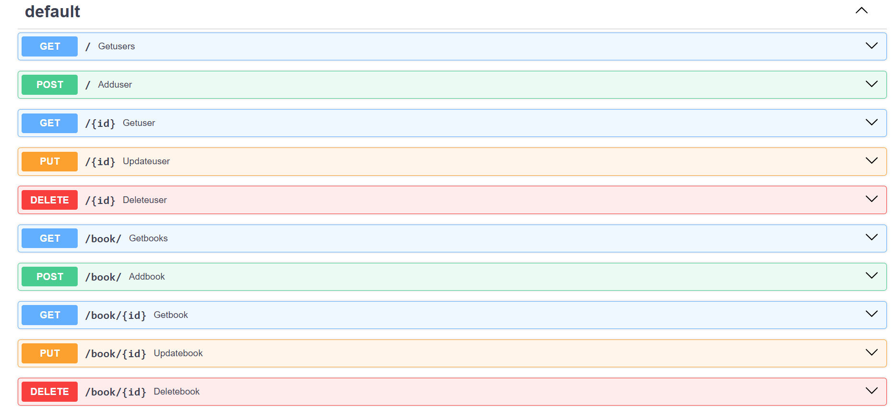

## Library project built with FastAPI

### This repository contains code of API for Library and Relationship between user and books using FastAPI and sqlite as Database.

## API Schema


#### To run code just create and activate your virtual environment
#### Then install requirement libraries from requirements.txt file wia
``` pip install -r requirements.txt```
#### And then to run your code use:
``` uvicorn mani:app```
##### or
``` uvicorn main:app --reload```
##### to use autorestart after changing code
#### To look through this app please visit
``` localhos:8000/docs ```